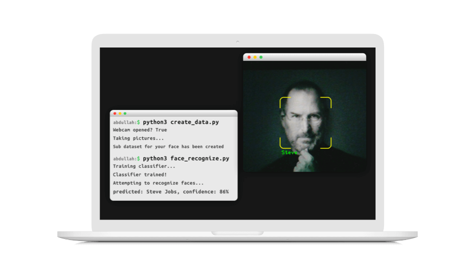

# OpenCV Face Recognition
This OpenCV application can detect and recognize your face, in real-time (using a webcam).



To run it yourself, follow these steps:
    In terminal: pip install opencv-contrib-python, then yo can run it
1. Change the `sub_dataset` variable (in the `create_data.py` file) to the name of the person whose face you're going to store.
2. Run `create_data.py` and wait for it to complete. Look into the camera at a few different angles and do this in a room with decent lighting.
3. If everything goes well, you may run `face_recognize.py` and watch it detect and recognize your face! It may take a while to train the classifier depending on a number of factors (size of your datasets, your hardware, etc.)

### Tips:
1. I recommend that you have multiple sub datasets of your face created with different lighting, face angle, etc. You can achieve this by putting spaces after your name in the `create_data.py` file.
2. When you run `face_recognize.py`, look at your camera and sit in the position you did when you created your face's dataset(s).
3. If you want to increase the chance of your face being recognized, create multiple sub datsets of your face.
4. You can also increase the number of pictures per sub dataset by changing the number in the while loop in the `create_data.py` file. This may also increase the chance of your face being recognized.

### Tested using:
```
- Python 3.5.2
- OpenCV 3.4.3.18
- NumPy 1.15.1
- elementary OS 0.4.1 Loki (Ubuntu 16.04.5 - Linux 4.15.0-46-generic)
```
